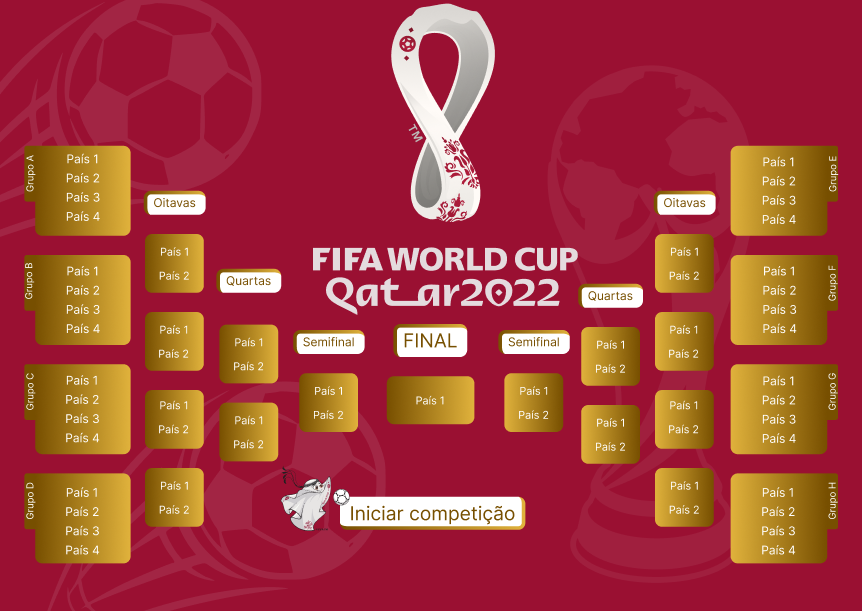

Projeto que simula a Copa do Mundo.

> Escopo:
São 32 seleções;
Em cada partida, a pontuação funciona da seguinte forma:
* 3 pontos caso vença;
* 1 ponto em caso de empate;
* 0 ponto caso perca.

No final, a seleção com maior pontuação ganha a rodada.

> ### [Projeto/Protótipo realizados no Figma](https://www.figma.com/file/V0gUUoy8JGCUN8AXZQNBdZ/geopost-energy-world-cup?node-id=1%3A2)

  

### Observações: o projeto não está completo e precisa passar por revisões na lógica por trás do funcionamento da geração das partidas. 
